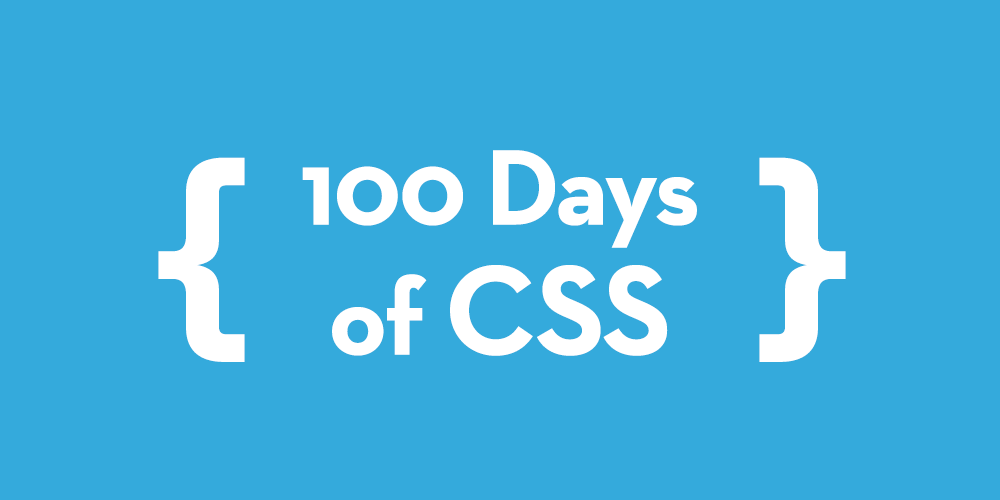

_100 Days of CSS_ is a personal project where I challenge myself to create and share a CSS design every day for 100 days. It's a journey of creativity, skill enhancement, and self-improvement in the realm of cascading style sheets.

# Projects:

1. [Credit Card UI Design](https://alin-trinca.github.io/100-Days-of-CSS/001%20Credit%20Card%20UI%20Design/dist/index.html)
2. [Task Tracker UI Design](https://alin-trinca.github.io/100-Days-of-CSS/002%20Task%20Tracker%20UI%20Design/dist/index.html)
3. [CSS Modal Window](https://alin-trinca.github.io/100-Days-of-CSS/003%20CSS%20Modal%20Window/dist/index.html)
4. [Pricing Table UI](https://alin-trinca.github.io/100-Days-of-CSS/004%20Pricing%20Table%20UI/dist/index.html)
5. [Signup Design UI](https://alin-trinca.github.io/100-Days-of-CSS/005%20Signup%20UI%20Design/dist/index.html)
6. [Dot pagination](https://alin-trinca.github.io/100-Days-of-CSS/006%20Dot%20Pagination/dist/index.html)
7. [CSS Fitness Tracker](https://alin-trinca.github.io/100-Days-of-CSS/007%20CSS%20Fitness%20Tracker/dist/index.html)
8. [CSS Checklist](https://alin-trinca.github.io/100-Days-of-CSS/008%20CSS%20Checklist/dist/index.html)
9. [CSS Loading Circle](https://alin-trinca.github.io/100-Days-of-CSS/009%20CSS%20Loading%20Circle/dist/index.html)
10. [CSS Lightbulb](https://alin-trinca.github.io/100-Days-of-CSS/010%20CSS%20Lightbulb/dist/index.html)
11. Hover Effect
12. CSS Sparkling Checkbox
13. CSS Word Carousel
14. CSS Gradient Transition
15. Hue Effect
16. CSS Tabs
17. CSS Animated Candle
18. CSS Newton's Cradle
19. User Profile
20. Send Email Animation
21. Sidebar Navigation Bar
22. Social Media Buttons
23. CSS Custom Checkbox
24. CSS Custom Toogle Switch
25. Custom Input Text
26. CSS Star Rating
27. Checkout Form
28. Cookies Notification
29. CSS Playing Card
30. CSS Reviews
31. Progress Steps
32. Search Widget
33. Split Landing Page
34. FAQ Collapse
35. Custom Range Slider
36. Kinetic Loader
37. Sticky Navigation
38. Mobile Navigation
39. CSS Timeline
40. CSS Contact Form
41. Glowing Neon Buttons
42. Card Hover Effect
43. Dropmorphism
44. Responsive Image Gallery
45. 3D Button Hover Animation
46. Responsive Pricing Cards
47. Neumorphic Login Form
48. Animated Login & SignUp Form
49. Side Navigation Bar
50. Task Management Dashboard
51. Netflix CSS Logo
52. Google CSS Logo
53. Nike CSS Logo
54. Instagram CSS Logo
55. TikTok CSS Logo
56. Adidas CSS Logo
57. Gmail CSS Logo
58. YouTube CSS Logo
59. React CSS Logo
60. Twitter X Logo
61. Responsive Card Slider
62. Responsive Cards Design
63. Blog Card Slider
64. Profile Card Slider
65. Ecommerce Product Card
66. Product Card Design
67. Vertical Card Sliding Animation
68. Email Subscription Box
69. Neumorphism Keyboard
70. Error Page Design
71. Wow Facebook Reaction
72. Navigation Menu Animation
73. Navigation Links Hover
74. Animated Skills Bar
75. Animated Background Effect
76. Fixed Social Media Sidebar
77. Glowing Cube
78. CSS Tabs
79. Responsive Footer
80. Neumorphism Loading Spinner
81. Rainy Night
82. CSS Tooltip
83. Slider with Radio Buttons
84. Ring Notification
85. Line Through Effect
86. Tricky Cookie
87. Gravity Switch
88. Image Reflection
89. Responsive Table
90. Loading Animation
91. Overlap Text Effect
92. Read More / Read Less
93. Text Stroke
94. Rainbow Border Animation
95. Netflix Login Page
96. Facebook Login Page
97. Instagram Login Page
98. GitHub Login Page
99. Gmail Login Page
100. 100 Days of CSS
